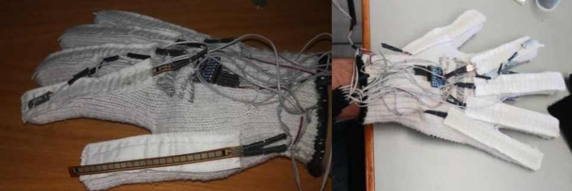

## Guante Traductor del Abecedario del Lenguaje de Señas

Código de Matlab y Arduino utilizado para el proyecto final de licenciatura.
Los archivos incluyen la captura, análisis y visualización de los datos.

* ### Resumen del proyecto

La comunicación de las personas con discapacidad auditiva con el resto de la gente es
complicada; a pesar de que existe la lengua de señas, una mínima parte de la población la
conoce.

En el presente proyecto, se diseñó un guante que permite traducir el abecedario de la
lengua de señas. A través del monitoreo y procesamiento de la información proporcionada por
diversos sensores colocados en el guante, se logró una adecuada clasificación de las señas
realizadas; el prototipo cuenta con la posibilidad de adaptarse para la formación de palabras
mediante el deletreo.

Los dispositivos utilizados son sensores de flexión resistivos (para detectar la flexión
de los dedos), un acelerómetro (para analizar el movimiento de la mano) y de contacto (para
confirmar el contacto entre algunos dedos). La información, es decir los valores resistivos de
las flexo-resistencias involucradas en la seña que se realiza, es adquirida durante cortos
intervalos de tiempo. Un promedio de los valores medidos es estimado por un ArduinoTM
Nano; después, los datos son enviados a un script de Matlab® de forma inalámbrica. A través
del código se obtienen las características de las señales obtenidas con el fin de entrenar una red
neuronal, la cual nos permite clasificar las señas realizadas como letras.

Los resultados indican que tanto el diseño físico como el algoritmo programado (red
neuronal) permiten clasificar la seña que los usuarios realizaron de manera aceptable, con
índices de error alrededor de 0.09 (casos clasificados erróneamente / total de casos).
Consideramos que la integración del hardware y su carácter inalámbrico le darían a nuestro
prototipo la capacidad de convertirse en un instrumento de utilidad para los usuarios de la
lengua de señas.

